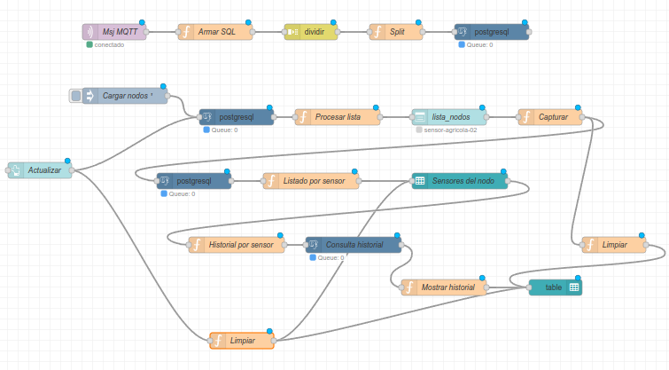
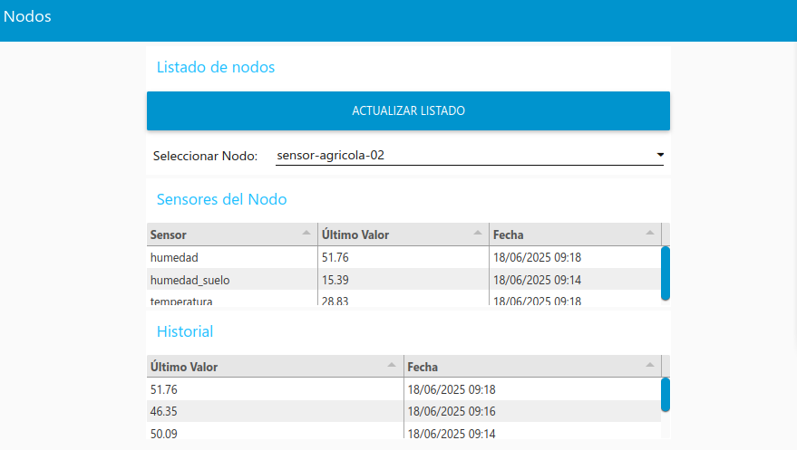

<div style="text-align: center;">

# 📡 Sistema IoT LoRa → MQTT

## Red de Sensores Agrícolas con Gateway ESP32

<div style="margin-top: 2em;">

**Asignatura**: Principios y Aplicaciones para dispositivos LoRa/LoRaWAN

**Docente**: Dr. Lic. Roberto Federico FARFÁN

**Alumno**: Claudio Omar BIALE

</div>

<div style="position: absolute; bottom: 20px; right: 20px; font-size: 0.8em; color: #666;">
Junio 2024
</div>

</div>

---

## Desarrollo de sistema de telemetría

- Hardware: ESP32 Heltec LoRa V2
- Protocolo: LoRa P2P → MQTT → PostgreSQL
- Stack: ESP32 + EMQx + Node-RED + PostgreSQL

*Proyecto desarrollado con Arduino IDE + Go + Node-RED*

---

## 🎯 Arquitectura del Sistema

```
┌─────────────┐   LoRa RF     ┌───────────────┐   WiFi/MQTT     ┌─────────────┐
│ Nodo Sensor │ ════════════► │ Nodo Receptor │ ══════════════► │   Broker    │
│  ESP32 TX   │   915MHz      │    ESP32 RX   │   JSON/1883     │    EMQx     │
└─────────────┘               └───────────────┘                 └─────────────┘
                                                                       │
                                                                MQTT Subscribe
                                                                       ▼
                                                                ┌─────────────┐
                                                                │  Node-RED   │
                                                                │ PostgreSQL  │
                                                                └─────────────┘
```

**Flujo de datos:** Sensores → LoRa → JSON → MQTT → Base de Datos

---

## 📡 Nodo Emisor LoRa

### Hardware: Heltec ESP32 LoRa V2
- **Microcontrolador:** ESP32 dual-core
- **Radio:** SX127x LoRa 915MHz
- **Alimentación:** USB
- https://heltec.org/project/wifi-lora-32v2/

---

## 📡 Nodo Emisor LoRa

### Sensores simulados

```cpp
// Payload cada 60 segundos
"ID:sensor-real-01,TEMP:44,HUM:90,HUMS:62,PRES:1007,LUM:11386"
```

- 🌡️ **Temperatura:** 5-45°C
- 💧 **Humedad ambiente:** 20-95%
- 🌱 **Humedad suelo:** 15-80%
- 📊 **Presión:** 950-1050 hPa
- ☀️ **Luminosidad:** 0-12000 lux

---

## 🔄 Nodo Receptor LoRa

### Funcionalidades
- **Recepción LoRa:** 915MHz, SF7, BW125kHz
- **Conversión JSON:** Payload compacto → Estructura normalizada
- **Conectividad:** WiFi + Cliente MQTT
- **Metadatos:** RSSI, SNR

---

## 🔄 Nodo Receptor LoRa

### Transformación de Datos
```json
// Input LoRa (60 caracteres)
"ID:sensor-real-01,TEMP:44,HUM:90,HUMS:62,PRES:1007,LUM:11386"

// Output MQTT JSON (244 caracteres)
{
  "id": "sensor-real-01",
  "rssi": -14,
  "snr": 9.5,
  "sensores": [
    {"tipoSensor": "temp", "valor": 44},
    {"tipoSensor": "hum", "valor": 90},
    {"tipoSensor": "hums", "valor": 62},
    {"tipoSensor": "pres", "valor": 1007},
    {"tipoSensor": "lum", "valor": 11386}
  ]
}
```

---

## 🌐 Broker MQTT - EMQx

### Configuración
- **Protocolo:** MQTT v3.1.1
- **Puerto:** 1883 (no TLS)
- **QoS:** 0 (fire and forget)
- **Tópico:** `mediciones/{id}`
- **IP Broker:** `192.168.0.105`

---

## 🔧 Simulador Go - Testing

### Implementación
```go
type LoRaMessage struct {
    Nodo            string       `json:"nodo"`
    Sensores        []SensorData `json:"sensores"`
    Timestamp       string       `json:"timestamp"`
    RSSI            int          `json:"rssi"`
    SNR             float64      `json:"snr"`
    Frecuencia      int          `json:"frecuencia"`
    SpreadingFactor int          `json:"spreadingFactor"`
    Bandwidth       int          `json:"bandwidth"`
    NodoOrigen      string       `json:"nodoOrigen"`
    NodoDestino     string       `json:"nodoDestino"`
    NumeroMensaje   int          `json:"numeroMensaje"`
    NivelBateria    int          `json:"nivelBateria"`
}
```
---

## 🔧 Simulador Go - Testing

### Características del Simulador
- 🎯 **Múltiples nodos:** `sensor-agricola-01`, `sensor-agricola-02`, etc.
- ⏱️ **Intervalo:** 30 segundos
- 📊 **Metadatos LoRa:** SF, RSSI, SNR, frecuencia
- 🔋 **Batería:** 85-100%
- 📈 **Tópicos dinámicos:** `mediciones/{nodo}`

---

## 🔄 Node-RED Flow

<style>
img[alt="centered"] {
  display: block;
  margin: 0 auto;
}
</style>



---

## 🖥️ Página implementada

<style>
img[alt="centered"] {
  display: block;
  margin: 0 auto;
}
</style>



---

## 🗄️ Persistencia - Node-RED + PostgreSQL

### Base de Datos PostgreSQL
```sql
   Column    |            Type             | Collation | Nullable |                     Default                     
-------------+-----------------------------+-----------+----------+-------------------------------------------------
 id_medicion | integer                     |           | not null | nextval('mediciones_id_medicion_seq'::regclass)
 tiempo      | timestamp without time zone |           | not null | 
 nodo        | character varying(100)      |           | not null | 
 tipo_sensor | character varying(100)      |           | not null | 
 valor       | double precision            |           | not null |
```

---

## Dashboard de Node-RED


### Funcionalidades Implementadas
- 📝 **Captura automática** de datos MQTT
- 💾 **Almacenamiento** en PostgreSQL
- 🔍 **Consultas por nodo** - últimos valores
- 📊 **Historial** - por tipo de sensor del nodo
- 📈 **Dashboard web** con Node-RED

---

## 📊 Métricas del Sistema

### Rendimiento LoRa
- **RSSI típico:** -12 a -21 dBm
- **SNR típico:** 9.25 a 10.5 dB

---

## 🛠️ Stack Tecnológico

### Hardware
- **MCU:** Tensilica LX6 de doble núcleo de 240 MHz
- **Radio:** Semtech SX127x LoRa
- **Alimentación:** USB

---

## 🛠️ Stack Tecnológico

### Software
- **Firmware:** Arduino IDE
- **Librerías:** LoRa, WiFi, PubSubClient
- **Broker:** EMQx MQTT
- **Backend:** Node-RED + PostgreSQL
- **Simulación:** Go + Paho MQTT

---

## 🛠️ Stack Tecnológico

### Protocolos
- **RF:** LoRa 915MHz
- **Network:** WiFi 802.11
- **Application:** MQTT v3.1.1
- **Data:** JSON estructurado

---

## 🔮 Próximos Pasos

### Mejoras Hardware
- ⚡ **Optimización energética** - deep sleep modes
- 🔋 **Panel solar** para autonomía total
- 📶 **Múltiples emisores** con protocolo anti-colisión

### Software 
- 🔐 **Seguridad:** TLS + autenticación
- 📊 **Cambiar a Dashboard 2:** cambio en Node-RED
- ☁️ **Cloud deployment** con escalado automático

---

## 💡 Demostración en Vivo

### Setup Actual
- 🔹 **Nodo emisor:** Enviando datos cada 60s
- 🔹 **Nodo receptor:** Convirtiendo a JSON y reenviado usando MQTT 
- 🔹 **EMQx Broker:** para comunicación MQTT
- 🔹 **Node-RED:** Capturando y almacenando
- 🔹 **PostgreSQL:** Base de datos operativa
- 🔹 **Simulador Go:** Generando datos de prueba

---

<div style="text-align: center; margin-top: 2em;">

# ¡Muchas gracias por su atención!

</div>

<div style="display: flex; justify-content: space-around; margin-top: 3em;">
  <div>
    <h3>Claudio Omar BIALE</h3>
    <p>📧 claudio.biale@gmail.com</p>
    <p>🔗 github.com/cbiale</p>
  </div>
  <div>
    <h3>Preguntas y Comentarios</h3>
    <p style="font-size: 3em;">❓</p>
  </div>
</div>